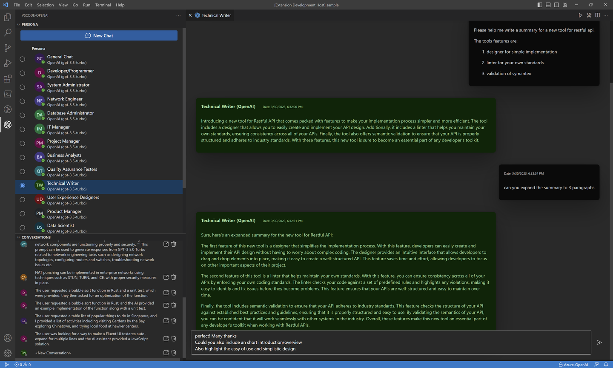
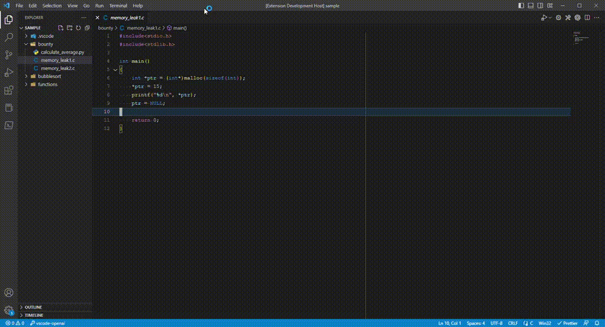
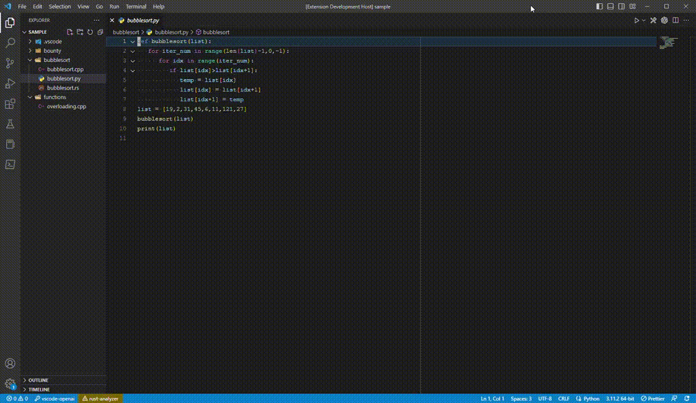
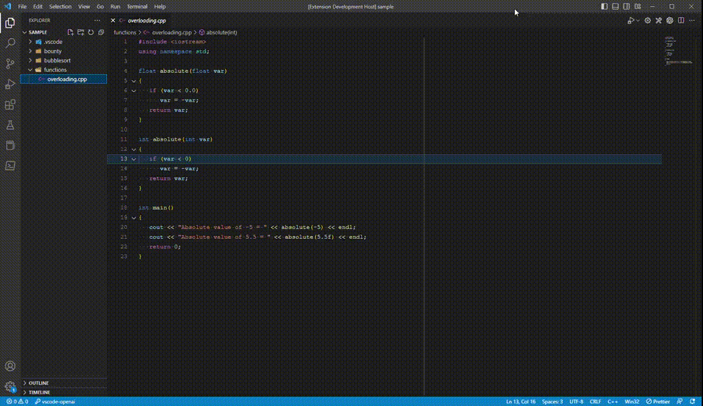
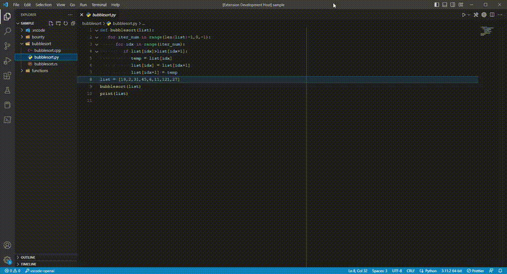

# vscode-openai

vscode-openai is a powerful extension for Visual Studio Code that utilizes OpenAI Turbo models to enhance your coding experience. With its advanced technology, this extension provides several features to make your coding process more efficient and effective. Currently uses **gpt-3.5-turbo**: 10 times cheaper than standard davinci. The cost of $0.002 per 1,000, average request size is 100 tokens.

Simply enter your OpenAI Api-Key and enjoy the productivity.

## What features are provided

### Chatbot

The vscode-openai extension provides direct access to chatbot features directly from within your code editor. Say goodbye to switching back and forth between different applications to get answers to your questions - now you can get instant responses without leaving your coding environment.

Our chatbot features are designed to make your coding experience smoother by providing quick answers to your coding questions. Whether you need help with syntax or debugging or want to learn more about a specific topic, our chatbot is here to assist you. We provide accurate and timely responses, so you can stay focused on your work without interruption.

With the ChatBot Extension for Visual Studio Code, you can get the answers you need right when you need them, without any distractions. So why not give it a try? Download our extension today and experience the convenience of having a chatbot at your fingertips while coding.

### Bug Bounty

One of the critical features of vscode-openai is its powerful bug-finding capabilities. With this feature, you can easily select a method, and the extension will analyze your code, highlighting any potential bugs that could cause issues down the line. This functionality enables you to proactively identify and correct errors, improving your codebase's overall quality and reliability. By leveraging this tool, you can ensure that your software runs at peak performance and delivers the best possible experience for end-users.

### Optimize

Another powerful feature of vscode-openai is its ability to optimize selected methods. By analyzing your code, this extension can suggest specific optimizations to enhance the performance of your code and reduce execution time. These suggestions include streamlining loops, reducing variable allocations, or applying better algorithms to your code. By incorporating these optimizations, you can significantly increase the speed and efficiency of your application, leading to better user experiences and more reliable software. This feature is particularly useful for large-scale applications or complex algorithms, where performance improvements can significantly impact the overall functionality and usability of the software. With vscode-openai, you can write more efficient code, save time, and build better software.

### Explain

vscode-openai can explain selected methods in plain language. This feature is particularly useful for developers who are just starting or may need to become more familiar with certain coding concepts. With this feature, you can select a method and generate an explanation that breaks down the code's functionality into plain language. This makes it easier to understand how the code works and how it can be utilized in your application. In addition, the explanation generated by the extension is clear and concise, providing a helpful guide for those needing help understanding a particular method. Whether you're new to coding or need a refresher on a specific concept, this feature can help you improve your understanding and accelerate your development process. You can write better code and build more effective software applications by leveraging this functionality.

### Comments

vscode-openai also has a feature to add comments for selected methods. With this feature, you can easily add comments to your code, helping you to organize your thoughts and make your code more readable and maintainable. In addition, by providing context and explanations for your code, you can make it easier for others to understand and modify your code in the future. This can save you time and effort in the long run and make your code more robust and reliable.

In addition, the advanced features and powerful technology offered by vscode-openai make it a must-have extension for any developer looking to improve their coding skills and streamline their workflow. Whether a beginner or an experienced developer, this tool can help you write better code faster. By leveraging the bug-finding and optimization features of vscode-openai, you can ensure that your code is error-free and performs optimally. And with the ability to explain selected methods in plain language and add comments for increased readability and maintainability, you can write efficient and understandable code. Overall, vscode-openai is a powerful and indispensable tool for developers at all levels who want to improve their coding skills and achieve fantastic success in their work.

### Design Patterns

vscode-openai helps analyze code and suggest suitable design patterns. This feature can be beneficial for newer developers who may still need to gain a deep understanding of established design patterns and their benefits.

Design patterns are proven solutions to common software development problems, and implementing them can significantly improve your code's quality, maintainability, and scalability. However, choosing the correct design pattern for a specific problem can be difficult and requires a solid understanding of the underlying concepts.

That's where vscode-openai comes in. By analyzing the structure and behaviour of your code, the extension can suggest suitable design patterns that are best suited for the specific code you're working on. This can save you time and effort in researching and implementing design patterns manually, allowing you to focus on the development of your application. Moreover, by leveraging the suggested design patterns, you can write more robust, scalable and maintainable code, enhancing the overall quality of your application.

Overall, the design pattern suggestion feature of vscode-openai is a powerful tool that can help developers of all levels write better code more efficiently. By leveraging this feature, you can build more practical applications that are easier to maintain and scale, saving you time and effort in the long run.

Understand the importance of having the right tools to make your work easier and more efficient. That's why I'm excited to introduce vscode-openai, a free extension for VS Code that uses the power of OpenAI to provide advanced features and technology to developers of all levels.

Whether a beginner or an experienced developer, vscode-openai can help you improve your coding skills and streamline your workflow. Its features include bug-finding, optimization, explanation, commenting, and design pattern suggestion, which can help you write better code more quickly.
One of the critical benefits of vscode-openai is its use of the latest and most cost-effective models from OpenAI. This means you can enjoy advanced technology's benefits without breaking the bank. Furthermore, compared to other tools on the market, this extension is affordable for developers who want to improve their coding skills and create more efficient applications.

Using vscode-openai can also help you to write more readable, maintainable, and scalable code. In addition, the explanation and commenting features help you to communicate more effectively with other developers and organize your thoughts. In contrast, the design pattern suggestion feature can save you time and effort in researching and implementing established solutions to common problems.

Overall, vscode-openai is a valuable tool for developers who want to improve their coding skills and streamline their workflow. Its advanced features and affordable price point make it a must-have extension for anyone looking to write better code faster.

## FAQ

### Why is this not Open Source

The repo is not "Public" but will be in the future. This extension is still in feature mode and active development. Like all of my extensions, this will become open-source soon. However, I would like to introduce a few more "advanced" features before opening for contribution. As with all of my extensions, help is always greatly received and very much appreciated.

### What's Next

The features in development are:

- Prompt Developer
- Embedding Analysis (Debugging vectors)
- More Developer Features
