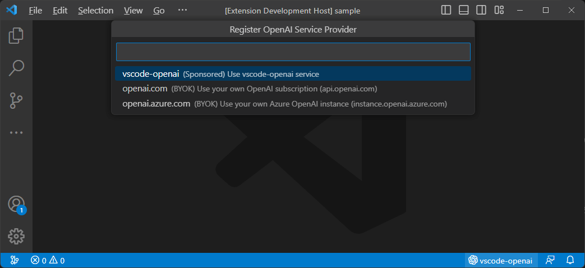
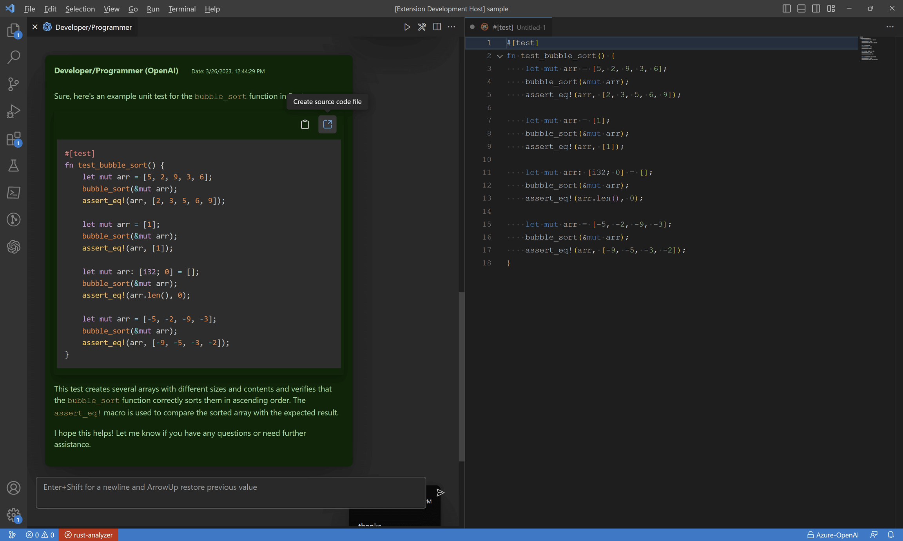
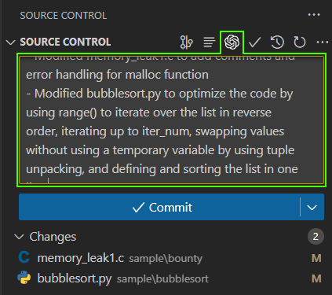
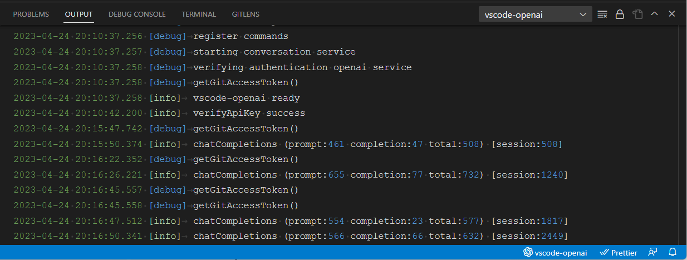

# vscode-openai

The vscode-openai extension is a great tool that allows you to access openai features directly from your code editor. This means that you don't have to switch between different applications to get answers to your questions - you can get instant responses without leaving your coding environment.

The extension offers support for a **sponsored (free) openai instance** for extension users, as well as **Bring-Your-Own-Key (BYOK)** for native **openai** and **azure-openai**. The quickpick menu system makes it easy to configure service providers quickly, and you can also customize the configuration settings if needed. For more information on how to do this, please refer to the Configuring Service Providers section.

If you're having trouble connecting to your own OpenAI service, please check out the [Detecting Issues](#detecting-issues) segment for troubleshooting tips.

# Provided features

## Setup

The quick pick feature in vscode-openai is a useful tool that simplifies the process of configuring service providers. You have the option to select from sponsored, native, or azure-openai instances based on your requirements. This feature saves you time and effort by providing step-by-step guidance and personalized settings. Once configured, you can seamlessly use openai features within vscode without any disruption to your workflow.

Note: To activate the setup, you can either use the command **"vscode-openai.register.openaiService"** or access it through the **vscode-openai StatusBar** located at the bottom left of vscode.

## Chatbot

The vscode-openai chatbot features are designed to make your coding experience smoother by providing quick answers to your coding questions. Whether you need help with syntax or debugging or want to learn more about a specific topic, our chatbot is here to assist you. We provide accurate and timely responses, so you can stay focused on your work without interruption.

With the ChatBot Extension for Visual Studio Code, you can get the answers you need right when you need them, without any distractions. So why not give it a try? Download our extension today and experience the convenience of having a chatbot at your fingertips while coding.

When vscode-openai provides code examples you can copy directly into the clipboard or send the results to a new (source code) documents.

## Source Control

The vscode-openai extension has a powerful feature that allows it to automatically generate comments by analyzing source code changes. This feature saves developers time and effort by automating the process of writing comments for their code.

When you make changes to your code, the vs code-open extension analyzes those changes and generates comments based on the context of the change. For example, if you add a new function to your code, the extension will create a comment describing what it does and how it works.

This feature is handy for developers working on large projects or needing to make frequent changes to their code. By automating the process of writing comments, developers can focus on writing high-quality code without worrying about documenting every code change.

## VSCode Editor

Provides quick access to useful features whilst working with source code and design documents.

### Bug Bounty

vscode-openai's bug-finding feature analyzes your code and highlights potential bugs, allowing you to proactively identify and correct errors. This improves the quality and reliability of your codebase, ensuring peak performance and a better user experience.

### Optimize

vscode-openai optimizes code performance by suggesting specific optimizations such as streamlining loops, reducing variable allocations, or applying better algorithms. This feature is useful for large-scale applications or complex algorithms where performance improvements can significantly impact software functionality and usability. By incorporating these optimizations, you can build more efficient software that delivers better user experiences.

### Explain

vscode-openai explains coding concepts in plain language, making it easier for developers to understand. This feature is helpful for beginners or those needing a refresher. The generated explanation breaks down the code's functionality into clear language, providing a helpful guide. By leveraging this functionality, you can improve your understanding of coding concepts and accelerate your development process, resulting in better code and more effective software applications.

### Comments

vscode-openai allows you to add comments to selected methods, making your code more readable and maintainable. By providing context and explanations for your code, you can make it easier for others to understand and modify your code in the future, saving time and effort in the long run.

### Design Patterns

vscode-openai analyzes code and suggests suitable design patterns, saving time and effort for developers. Design patterns are proven solutions to common software development problems that can improve code quality, maintainability, and scalability. However, choosing the right pattern requires a solid understanding of the underlying concepts. By analyzing your code's structure and behavior, vscode-openai suggests suitable design patterns best suited for your specific code. This feature allows you to write more robust, scalable, and maintainable code while enhancing the overall quality of your application. Overall, this powerful tool helps developers of all levels build practical applications that are easier to maintain and scale in the long run.

## Summary

vscode-openai is a free vscode extension that provides advanced features and technology to developers of all levels. Its features include bug-finding, optimization, explanation, commenting, and design pattern suggestion, which can help you write better code more quickly. One of the critical benefits of vscode-openai is its use of the latest and most cost-effective models from OpenAI, making it an affordable option for developers who want to improve their coding skills.

Using vscode-openai can also help you to write more readable, maintainable, and scalable code. The explanation and commenting features help you communicate more effectively with other developers and organize your thoughts. Meanwhile, the design pattern suggestion feature saves time and effort in researching and implementing established solutions to common problems.

Overall, vscode-openai is a valuable tool for developers looking to streamline their workflow and improve their coding skills. Its advanced features make it a must-have extension for anyone looking to write better code faster at an affordable price point.

# Detecting Issues

###  **Not Found**

- Message: "**vscode-openai.openai.azure.com - not found**"
- Description: This error occurs if any of the configuration parameters are incorrect. Please check the following:
  - OpenAI:
    - The version (e.g. /v1) is present on the base url.
  - Azure: Check you have:
    - The openai segment (e.g. /openai) is on the base url.
    - The api-version is valid and is available in your region.
    - The deployment name is correct.

###  **Authentication Issue**

- Message: "**vscode-openai.openai.azure.com - failed authentication**"
- Description: This error occurs if your Api-Key is invalid. Check the Api-Key is valid for the instance or has expired

###  **Unknown Host**

- Message: "**vscode-openai1.openai.azure.com - unknown host**"
- Description: This error occurs if the host is not found. Either your Azure instance or your Api-Gateway URL can't be resolved. The following error will be displayed.

### Log Levels

If you're having issue with the extension use the trace log to check for more information.

# Configuring Service Providers

To configure your azure openai instance, you need to enter the following configuration:

- **Base URL:** The instance name. For example `https://<instance-name>.openai.azure.com/openai`
- **Deployment Name:** The name of the azure deployment. This will be used within inference calls
- **API Version:** The version of the azure api. Note that `2023-03-15-preview` onward is required for chat conversations

# FAQ

## Why is this not Open Source

The repo is not "Public" but will be in the future. This extension is still in feature mode and active development. Like all of my extensions, this will become open-source soon. However, I would like to introduce a few more "advanced" features before opening for contribution. As with all of my extensions, help is always greatly received and very much appreciated.

## What's Next

The features in development are:

- OAuth2 support for enterprises scenarios (Internal Proxy/Api Gateways)
- Prompt Developer
- Embedding Analysis (Debugging vectors)
- More Developer Features
