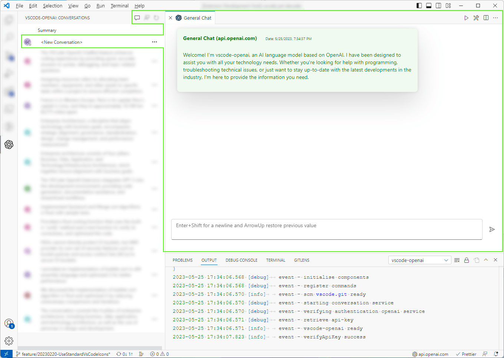
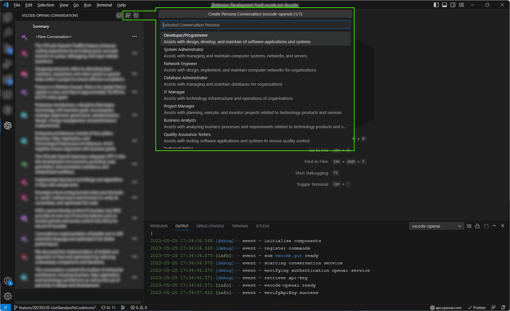
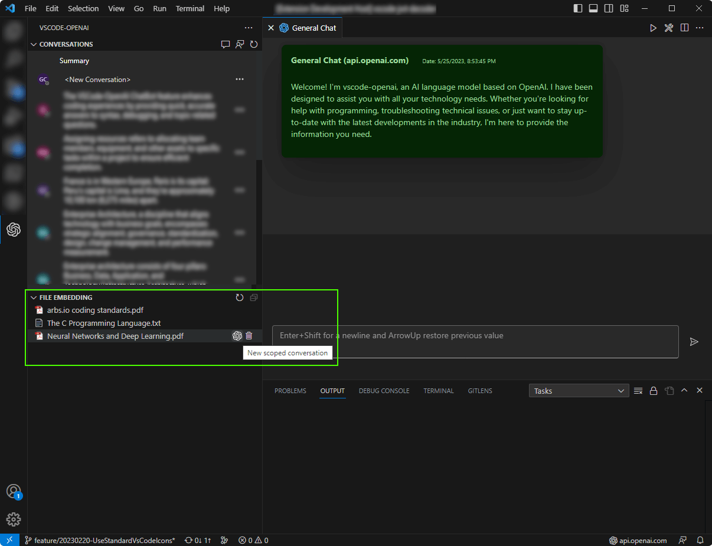

# vscode-openai

The VSCode-OpenAI extension is a powerful and versatile tool designed to integrate OpenAI features seamlessly into your code editor. By leveraging this extension, you can obtain instant answers to your questions without the need to switch between multiple applications, allowing you to maintain focus on your coding environment.

This extension provides support for both a **sponsored (free) openai instance** exclusive to extension users and **Bring-Your-Own-Key (BYOK)** options for native **OpenAI** and **Azure-OpenAI**. The intuitive quick-pick menu system enables rapid configuration of service providers, while also offering the flexibility to customize settings as needed. For detailed guidance on configuring service providers, please refer to the Configuring Service Providers section.

In case you encounter difficulties connecting to your own OpenAI service, the [Detecting Issues](#detecting-issues) segment offers troubleshooting tips and insights to help resolve any configuration issues. Experience an enhanced coding experience with the **vscode-openai** extension – your go-to solution for seamless interaction with OpenAI services.

# Features

## Setup

The Quick Pick feature of the VSCode-OpenAI extension is a convenient and efficient configuration for service providers. With options to choose from sponsored, native, or Azure-OpenAI instances, you can tailor your selection based on your specific needs. This feature not only saves time but also offers step-by-step guidance and customized settings to ensure a smooth setup experience.

Once configured, you can effortlessly utilize OpenAI features within VSCode without any interruptions to your workflow.

Note: To activate the setup, you have two options: either use the command **"vscode-openai.register.openaiService"** or access it through the **vscode-openai StatusBar** located at the bottom left corner of VSCode.

## Conversations

The vscode-openai conversation feature have been meticulously crafted to enhance your coding experience by providing rapid and accurate answers to your programming questions. Whether you require assistance with syntax, debugging, or wish to delve deeper into a specific topic, the extension is readily available to support you. By delivering precise and timely responses, we ensure that you can maintain focus on your work without any disruptions. Download our extension today and discover the convenience of having an intelligent chatbot at your fingertips while coding.

### Persona

The vscode-openai persona conversation feature offers a customized and interactive dialogue with an expert, designed to address your specific programming needs. This powerful functionality enables you to quickly access valuable insights and engage in carefully curated conversations that cater to your unique requirements.

By leveraging the expertise of our AI-driven chatbot, you can efficiently resolve coding challenges, explore new concepts, and receive guidance on best practices – all within the familiar environment of Visual Studio Code. Experience the benefits of having immediate access to a knowledgeable conversation partner, empowering you to enhance your skills and streamline your development process.

### Source Code

When vscode-openai provides code examples you can copy directly into the clipboard or send the results to a new (source code) documents.

## Source Control

The vscode-openai extension has a powerful feature that allows it to automatically generate comments by analyzing source code changes. This feature saves developers time and effort by automating the process of writing comments for their code.

When you make changes to your code, the vs code-open extension analyzes those changes and generates comments based on the context of the change. For example, if you add a new function to your code, the extension will create a comment describing what it does and how it works.

This feature is handy for developers working on large projects or needing to make frequent changes to their code. By automating the process of writing comments, developers can focus on writing high-quality code without worrying about documenting every code change.

## VSCode Editor

Provides quick access to useful features whilst working with source code and design documents. Each prompts can be customizable and works with any models.

- **Bug Bounty**: vscode-openai's bug-finding feature analyzes code, highlights potential bugs, and helps proactively identify and correct errors for improved code quality and reliability.
- **Optimize**: vscode-openai suggests specific optimizations to enhance code performance, such as streamlining loops or applying better algorithms, resulting in more efficient software and better user experiences.
- **Explain**: vscode-openai explains coding concepts in plain language, making it easier for developers to understand and improve their coding skills.
- **Comments**: vscode-openai allows adding comments to methods, improving code readability and maintainability by providing context and explanations.
- **Design Patterns**: vscode-openai analyzes code structure and behavior to suggest suitable design patterns, helping developers write more robust, scalable, and maintainable applications.

## Summary

vscode-openai is a free vscode extension that provides advanced features and technology to developers of all levels. Its features include bug-finding, optimization, explanation, commenting, and design pattern suggestion, which can help you write better code more quickly. One of the critical benefits of vscode-openai is its use of the latest and most cost-effective models from OpenAI, making it an affordable option for developers who want to improve their coding skills.

Using vscode-openai can also help you to write more readable, maintainable, and scalable code. The explanation and commenting features help you communicate more effectively with other developers and organize your thoughts. Meanwhile, the design pattern suggestion feature saves time and effort in researching and implementing established solutions to common problems.

Overall, vscode-openai is a valuable tool for developers looking to streamline their workflow and improve their coding skills. Its advanced features make it a must-have extension for anyone looking to write better code faster at an affordable price point.

# Coming Soon...

## Custom Source Integration

This new feature for vscode-openai provides a powerful addition allows users to load their own sources to enhance the conversation experience and provide tailored assistance based on the latest standards, library documentation, or specialist subjects.

Key Benefits:

- **Personalized Assistance**: By uploading your own resources, you can receive personalized guidance and support based on the specific materials you're working with. This ensures that the information provided is relevant and up-to-date according to your needs.
- **Enhanced Learning**: With access to specialized content like research papers or industry-specific documentation, you can deepen your understanding of niche topics and stay ahead in your field.
- **Streamlined Workflow**: Integrating custom sources directly into vscode-openai enables seamless access to relevant information without having to switch between multiple applications or browser tabs.

How It Works:

- **Upload Your Sources**: Easily upload documents in various formats (e.g., pdf, docx, ...) through a user-friendly interface within vscode-openai.
- **Indexing and Processing**: Once uploaded, vscode-openai will index and process the content of your documents, making them available for use during conversations.
- **Smart Contextual Assistance**: When asking questions or seeking help related to your custom sources, vscode-openai will intelligently search through the uploaded content and provide accurate answers based on the information found in those documents.

Use Cases:

- Developers can upload coding standards or library documentation specific to their projects for quick reference while working on code.
- Researchers can import research papers or articles related to their field of study for easy access when discussing complex concepts.
- Educators can integrate course materials or textbooks into vscode-openai for efficient lesson planning and student support.

With Custom Source Integration for vscode-openai, users now have an even more powerful tool at their disposal, enabling them to stay informed and up-to-date with the latest standards, libraries, and specialist subjects. This feature not only enhances the overall user experience but also empowers developers, researchers, and educators alike to excel in their respective fields.

todo

###  **Not Found**

# Detecting Issues

###  **Not Found**

- Message: "**vscode-openai.openai.azure.com - not found**"
- Description: This error occurs if any of the configuration parameters are incorrect. Please check the following:
  - OpenAI:
    - The version (e.g. /v1) is present on the base url.
  - Azure: Check you have:
    - The openai segment (e.g. /openai) is on the base url.
    - The api-version is valid and is available in your region.
    - The deployment name is correct.

###  **Authentication Issue**

- Message: "**vscode-openai.openai.azure.com - failed authentication**"
- Description: This error occurs if your Api-Key is invalid. Check the Api-Key is valid for the instance or has expired

###  **Unknown Host**

- Message: "**vscode-openai1.openai.azure.com - unknown host**"
- Description: This error occurs if the host is not found. Either your Azure instance or your Api-Gateway URL can't be resolved. The following error will be displayed.

### Log Levels

If you're having issue with the extension use the trace log to check for more information.

# Configuring Service Providers

To configure your azure openai instance, you need to enter the following configuration:

- **Base URL:** The instance name. For example `https://<instance-name>.openai.azure.com/openai`
- **Deployment Name:** The name of the azure deployment. This will be used within inference calls
- **API Version:** The version of the azure api. Note that `2023-05-15` onward is required for chat conversations

# FAQ

## Why is this not Open Source

The repo is not "Public" but will be in the future. This extension is still in feature mode and active development. Like all of my extensions, this will become open-source soon. However, I would like to introduce a few more "advanced" features before opening for contribution. As with all of my extensions, help is always greatly received and very much appreciated.

## What's Next

The features in development are:

- OAuth2 support for enterprises scenarios (Internal Proxy/Api Gateways)
- Prompt Developer
- Embedding Analysis (Debugging vectors)
- More Developer Features
